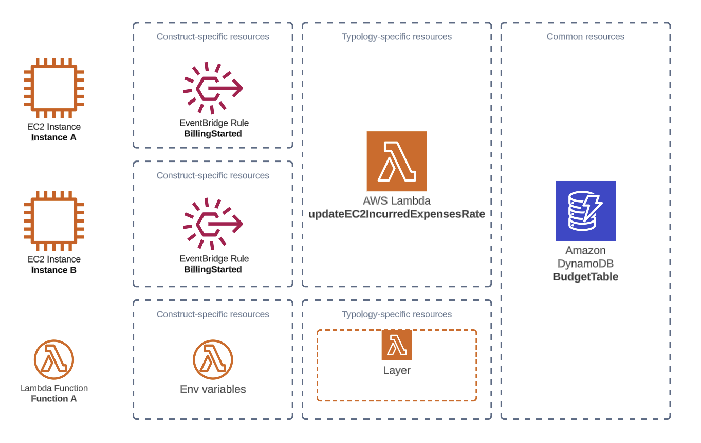

# Design Principles

## Project scopes

### Construct-specific resources

Construct-specific resources are provisionned in the `limitBudget` static method of each Construct defined in this library. They are specific to a certain typology of resource (i.e. Lambda Function construct-specific resources includes the attachment of a layer and additional env variables while EC2 Instance construct-specific resources includes an event-bridge rule). If one resource can be leveraged for multiple instances of the same typology of resources, it should be provisionned in the typology-specific resources.

### Typology-specific resources

Typologoy-specific resources are common resources that can be leveraged by multiple constructs of the same type. They are deployed only if at least one resource of the same typology is under the scope of a budget.

> Both construct-specific resources and typology-specific resources are used update current expenses for each budget. They update the `accruedExpenses` attribute of one or all budgets affected by a specific construct when under-budget resource pricing model is per-usage. They update the `inccuredExpensesRate` attribute of one or all budgets affected by a specific construct when under-budget resource pricing model is per-reservation. They are in charge of disabling their under-budget resource when `accruedExpenses` is already over budget.

### Common resources

Common resources are always deployed.

## Key factors weights in a specific architectural decision

In order of importance:

### Accuracy

Using CUR or billing APIs lack frequent update. They cannot be relied on for accurate accrued expenses computation.

### Performance

Should not degrade existing performance.

### Cost

Additional costs generated by resources required to keep track of current expenses shall be kept at a minimum
